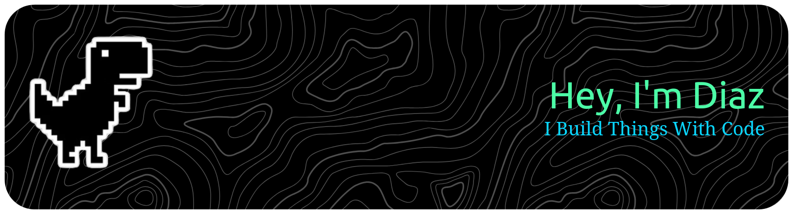

I’m currently sharpening my programming skills as I continue my career. My learning journey focuses on software development, cybersecurity, and the Internet of Things. My goal is to contribute to the developer community through participation in open-source projects and writing.

  
  
  

<h3>About Me :mortar_board:</h3>

- Interested in Web and Mobile applications, Cybersecurity, and Internet of Things.
- I have worked professionally for 3+ years, with some freelance in between.
- Enjoy for designing and breaking down system, while working on projects to make them clear and easier to maintain.
- Love to talk about ideas, especially around tech and startups.
- Continuously improving through projects, documentation, experiments, and collaboration.

<h3>Goals :rocket:</h3>

- Getting into habit of writing more often on my website about discoveries, issues, and personal thoughts.
- Sharpening my skills in deployments, CI/CD, and Application Security.
- Contributing to the developer community by participating in open-source projects.

  
  
  
  
  
  
  
  
  
  
  
  

<table align="center">
  <tr>
    <td width="49%" valign="top">
      
    </td>
    <td width="2%"></td>
    <td width="49%" valign="top">
      
       
      
    </td>
  </tr>
</table>
